# 🔐 Static Analysis Lab – OWASP UnCrackable Level 1

## 📌 Overview

This repository contains the complete static analysis of **OWASP UnCrackable Level 1 APK** as part of a mobile security lab.

The objective of this lab is to:
- Prepare a structured analysis workspace
- Verify APK integrity
- Perform static analysis using JADX GUI
- Identify sensitive information
- Convert DEX → JAR using dex2jar
- Compare JADX and JD-GUI
- Produce a professional mini security report

---

# 🧩 Task 1 — Workspace Preparation & APK Verification

## 1️⃣ Create Working Directory

```powershell
mkdir C:\APK-Analysis
cd C:\APK-Analysis
```

## 2️⃣ Verify APK is a ZIP archive

```powershell
Get-Content -Path .\UnCrackable-Level1.apk -TotalCount 4 | Format-Hex
```

APK header begins with **50 4B (PK)** → Valid ZIP archive.

📸 Screenshot:
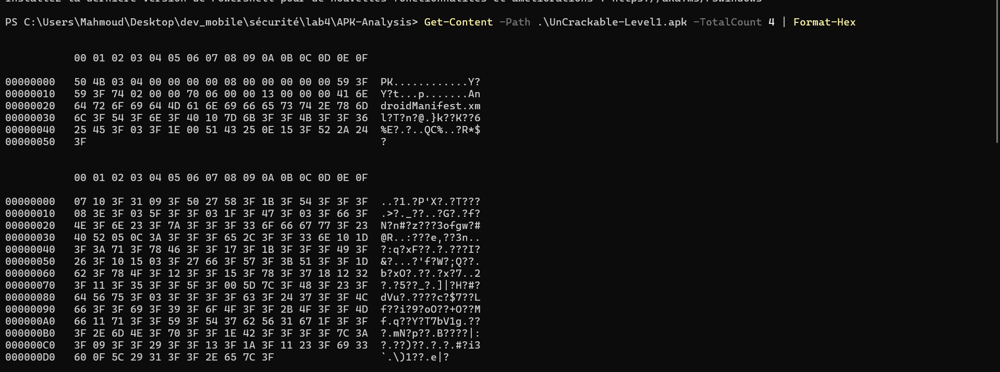

---

## 3️⃣ List APK Content

```powershell
Add-Type -Assembly System.IO.Compression.FileSystem
$apk = Join-Path (Get-Location).Path "UnCrackable-Level1.apk"
[System.IO.Compression.ZipFile]::OpenRead($apk).Entries | Select-Object -ExpandProperty FullName -First 20
```

📸 Screenshot:
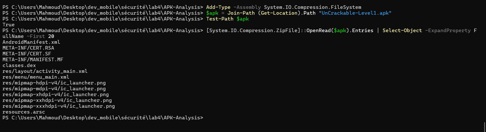

---

## 4️⃣ Calculate SHA-256 Hash

```powershell
Get-FileHash -Algorithm SHA256 .\UnCrackable-Level1.apk
```

📸 Screenshot:
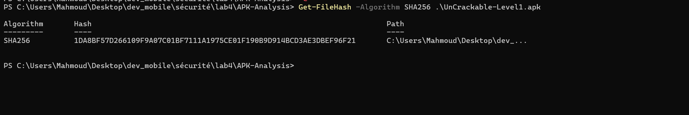

✅ Checklist:
- Workspace created
- APK verified as valid archive
- SHA-256 hash documented
- Basic structure identified

---

# 📦 Task 2 — Obtaining the APK

Source used:
- OWASP MSTG Crackmes – Android UnCrackable Level 1

APK placed inside working directory.

📸 Screenshot (APK selection in JADX):
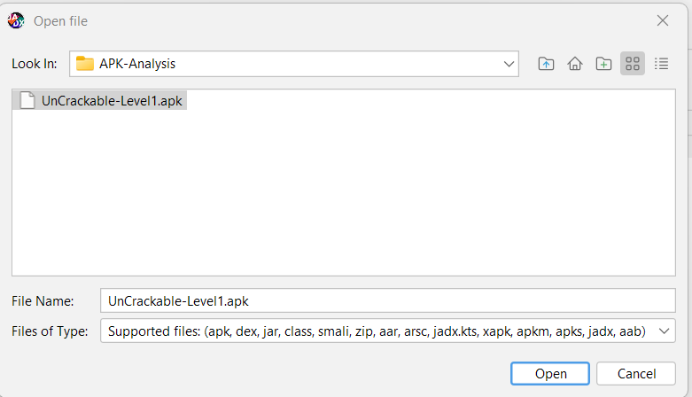

---

# 🔎 Task 3 — Analysis with JADX GUI

## Open APK in JADX GUI

📸 Screenshot:
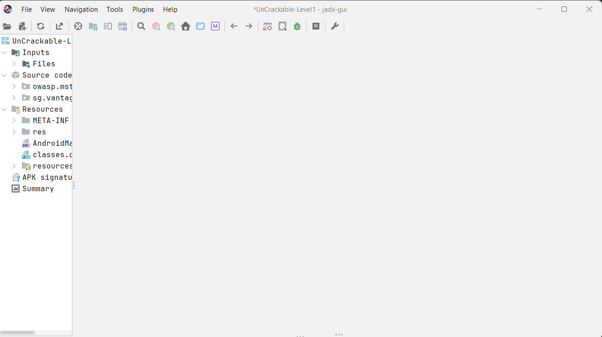

---

## 📄 AndroidManifest Analysis

Identified:

- **Package:** owasp.mstg.uncrackable1
- **versionName:** 1.0
- **minSdkVersion:** 19
- **targetSdkVersion:** 28
- Main Activity: `sg.vantagepoint.uncrackable1.MainActivity`
- Intent-filter: MAIN + LAUNCHER

📸 Screenshot:
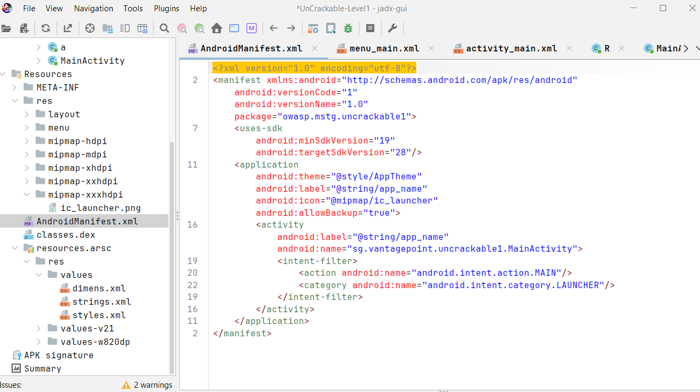

---

## 📁 strings.xml Analysis

Found UI strings including:
- "Enter the Secret String"
- "Verify"
- "This is the correct secret."

📸 Screenshot:
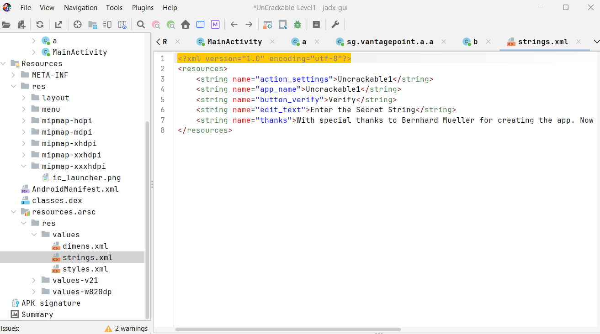

---

## 🔍 Sensitive Configuration Checks

Search for:
- http://
- .com
- debug
- dev
- secret

📸 Search HTTP:
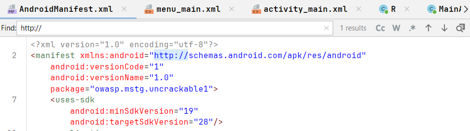

📸 Search .com:
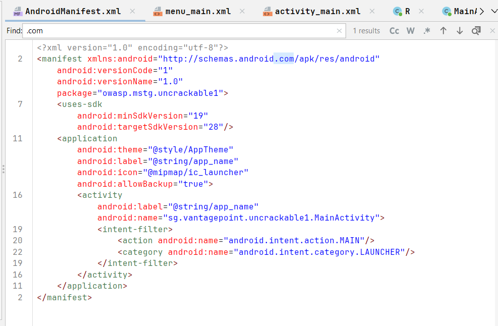

📸 Search dev:
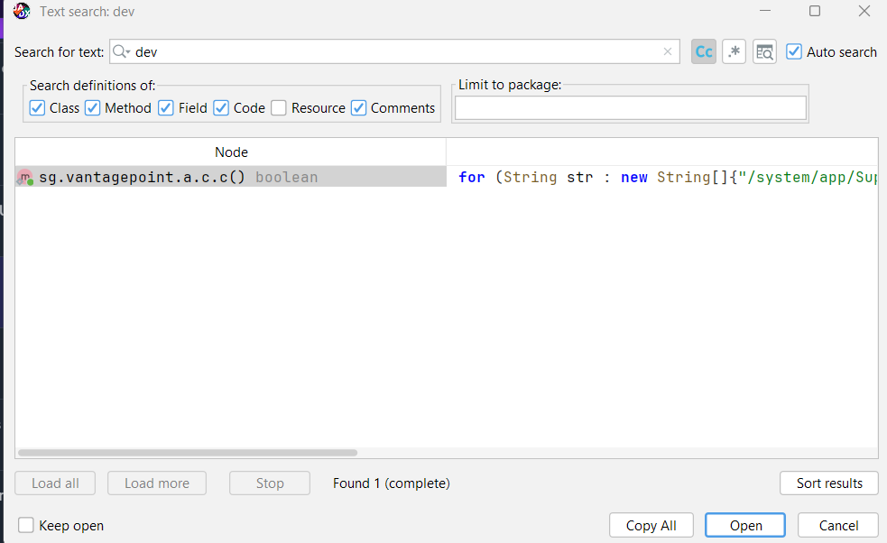

📸 Search secret:
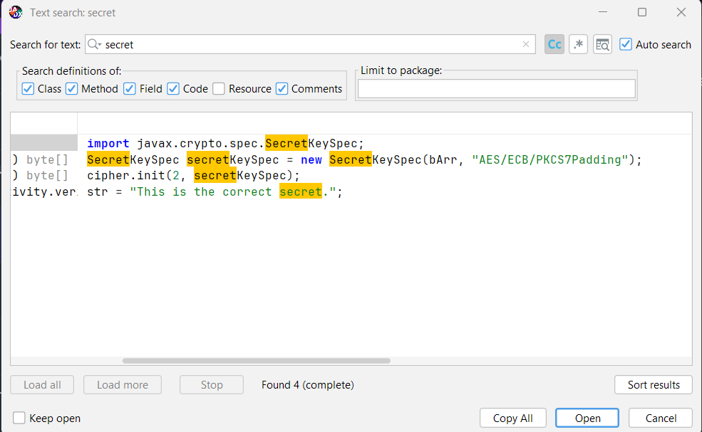

📸 Search debug:
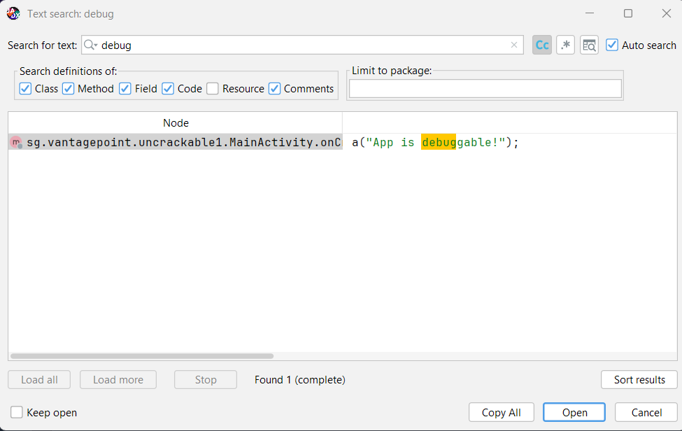

---

### Key Observations

1. Root detection implemented
2. Debug detection present
3. Secret validation logic in MainActivity
4. AES/ECB/PKCS7Padding usage
5. Hardcoded success message

---

# 🔄 Task 5 — DEX → JAR Conversion

## Extract classes.dex

```powershell
mkdir dex_out
```

📸 Screenshot:
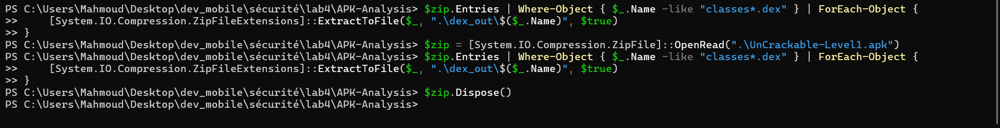

---

## Convert using dex2jar

```powershell
d2j-dex2jar.bat classes.dex -o app.jar
```

📸 Screenshot:
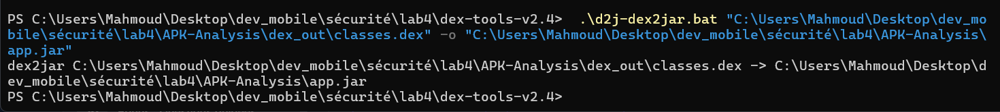

---

# 🔍 Task 6 — JADX vs JD-GUI Comparison

Opened generated JAR in JD-GUI.

📸 Screenshot:
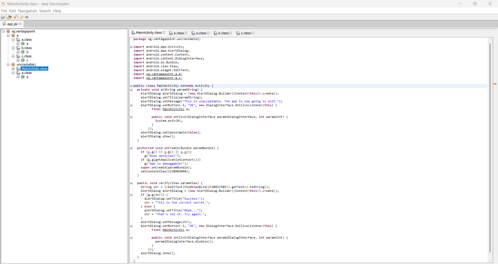

---

## Comparison Summary

| Aspect | JADX GUI | JD-GUI |
|--------|----------|--------|
| Android Resources | Full support | Not supported |
| Manifest View | Yes | No |
| Kotlin Handling | Better | Limited |
| Obfuscation Handling | Attempts recovery | Keeps obfuscated names |
| Navigation | Android-aware | Pure Java view |

Conclusion:
- **JADX** is better for Android-focused analysis.
- **JD-GUI** useful for pure Java bytecode inspection.

---

# 📄 Task 7 — Mini Security Report

## General Information

- **Application:** OWASP UnCrackable Level 1
- **Version:** 1.0
- **Analyst:** Mahmoud Laasri
- **Tools Used:** JADX GUI, dex2jar, JD-GUI
- **Hash (SHA-256):** 1DA8BF57D266109F9A07C01BF7111A1975CE01F190B9D914BCD3AE3DBEF96F21

---

## Executive Summary

Static analysis revealed multiple intentional security mechanisms:

- Root detection
- Debug detection
- Secret validation logic
- Cryptographic implementation (AES)

Overall Risk Level: **Medium**  
(App intentionally hardened as crackme challenge)

---

## Detailed Findings

### Finding #1 – Root Detection
**Severity:** Medium  
**Location:** MainActivity → onCreate  
**Description:** Application checks for rooted device  
**Impact:** Prevents dynamic analysis  
**Remediation:** Use secure server-side validation

---

### Finding #2 – Debug Detection
**Severity:** Medium  
**Location:** MainActivity  
**Description:** App checks if debugging enabled  
**Impact:** Blocks debugging attempts  
**Remediation:** Avoid relying only on client-side checks

---

### Finding #3 – Hardcoded Success String
**Severity:** Low  
**Location:** strings.xml  
**Description:** Success message stored in resources  
**Impact:** Information disclosure  
**Remediation:** Avoid exposing sensitive logic client-side

---

## Annexes

### Permissions
(No dangerous permissions requested)

### Exported Components
MainActivity (LAUNCHER)

---

# ✅ Lab Completion Checklist

✔ Workspace prepared  
✔ APK integrity verified  
✔ Manifest analyzed  
✔ Sensitive strings searched  
✔ DEX extracted  
✔ JAR generated  
✔ Tools compared  
✔ Professional report written  

---

# 👨‍💻 Author

Mahmoud Laasri  
Mobile Security Lab  
